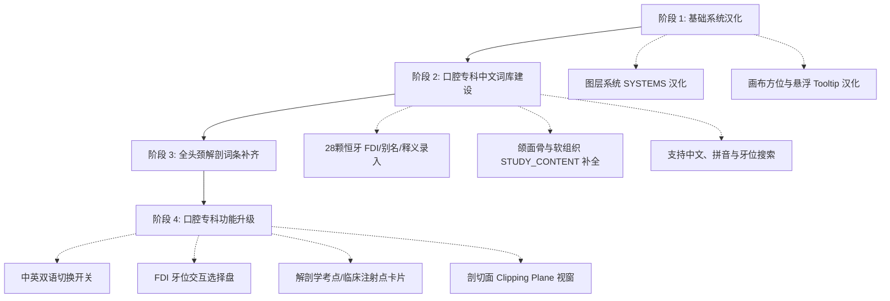

# AGENTS.md — YuAnatomy 开发者与 AI 协作维护指南

本文档为参与 **YuAnatomy**（口腔解剖浏览器）维护、汉化与功能迭代的 AI Agent 及人类开发者提供统一的工程规范、架构说明、医学约定及维护准则。

---

## 1. 项目愿景与技术定位

* **定位**：面向口腔医学本科教学与临床规培的轻量级、零后端依赖、高精度的三维头颈部解剖浏览器。
* **上游溯源**：基于 [Human Atlas](https://github.com/ashemag/human-atlas)（ashemag, MIT）与日本生命科学数据库中心 [BodyParts3D 4.0](https://dbarchive.biosciencedbc.jp/en/bodyparts3d/lic.html)（CC BY 4.0）。
* **交付目标**：
  * 无需数据库、无需用户登录、无需外部 AI/云端服务，开箱即用。
  * 纯静态部署（支持本地一键运行及静态 Web 托管）。
  * 几何高保真、三维交互流畅、医学术语准确严谨。

---

## 2. 技术栈与核心依赖

| 模块 | 技术选型 | 说明 |
| :--- | :--- | :--- |
| **框架** | React 19.2 + TypeScript 5.9 | 前端组件化与类型安全 |
| **构建工具** | Vite 8.0 | 开发热重载与极速静态构建 |
| **3D 引擎** | Three.js (0.159.0) | WebGL 渲染管线、相机控制、拾取与着色器注入 |
| **图标库** | Lucide React (1.31.0) | 统一现代线框图标 |
| **数据管线** | Python 3 + Node.js ES Modules | 二进制几何打包与深度数学校验 |

---

## 3. 目录结构速览

```text
YuAnatomy/
├── app/                        # 核心前端与 3D 渲染逻辑
│   ├── anatomy.ts              # 解剖系统数据定义、系统图层与调色板
│   ├── study.ts                # 口腔/头颈知识库（STUDY_CONTENT）、预设视图与检索别名
│   ├── yu-anatomy.tsx          # 主界面交互逻辑、状态管理、侧边栏与弹窗
│   ├── yu-anatomy.css          # 全端响应式样式（桌面/平板/手机）
│   ├── scene.tsx               # Three.js 场景管理、自定义着色器、拾取与动画
│   ├── explosion-layout.ts     # 100% 拆解时的 2D 阵列防重叠排布算法
│   ├── model-download.ts       # 二进制模型块下载与解压流处理
│   └── pointer-tap.ts          # 触控与鼠标手势判定（防误触与区分拖拽）
├── public/                     # 静态资源
│   ├── head-neck/              # 模型数据包
│   │   ├── atlas.json          # 591 个部件与 1181 个概念的索引元数据
│   │   ├── head-neck-hd-*.bin  # 原始二进制几何数据（Float32顶点 + Int16法线 + Uint32索引）
│   │   └── head-neck-hd-*.bin.gz # Gzip 压缩分块（用于网络加载，约 25.5MB）
│   └── branding/               # 图标与桌面快捷方式图标
├── scripts/                    # 维护与构建脚本
│   ├── validate-head-neck.mjs  # 自动化工程验收脚本（模型、拓扑、预设、手势深度校验）
│   ├── build-head-neck.py      # 模型裁剪、坐标平移与分块打包脚本
│   ├── fetch-source-obj.py     # 上游 OBJ 缓存校验与下载脚本
│   └── launch.ps1              # 本地静默服务拉起与浏览器打开脚本
├── docs/                       # 覆盖度统计与历史验证日志
│   ├── model-coverage.json     # 全量部件统计、入选与排除规则记录
│   └── verification.md         # 验收记录与变更审计
├── Start-YuAnatomy.cmd         # Windows 本地双击启动脚本
└── package.json
```

---

## 4. 关键原则与红线约定（Agent 必须严格遵循）

### 4.1 绝对禁止修改原始模型 ID 与概念 ID
* 网格的 `FJxxxx` ID（如 `FJ1254`）和解剖概念的 `FMAxxxx` ID（如 `FMA55704`）是与底层几何二进制块绑定的唯一键。
* **绝对不要尝试汉化或改写任何 ID 字段**。汉化和别名必须通过 `STUDY_CONTENT` 字典进行扩展映射。

### 4.2 保持几何数据与验证体系的完整性
* 几何数据目前保留 BodyParts3D 发布的原始三角面数量（591 个网格，1,970,872 个三角形）。
* 任何对数据结构的改动，必须确保能通过：
  ```bash
  npm run check      # TypeScript 类型检查
  npm run validate   # 数据拓扑、包围盒与算法校验
  npm run build      # Vite 构建验证
  ```

### 4.3 零后端与轻量化约束
* 软件设计为纯前端静态应用，禁止引入外部 Node.js 后端服务、数据库驱动、或非必要的外部云端 API 依赖。
* 保护包体积，前端依赖引入需保持谨慎。

---

## 5. 口腔医学与解剖知识库扩展规范

### 5.1 数据映射标准：`app/study.ts`
所有中文名称、别名、拼音搜索、教材释义均录入 `app/study.ts` 中的 `STUDY_CONTENT`：

```typescript
export interface StudyEntry {
  displayName?: string;  // 审定中文名称，如 "左下第一恒磨牙"
  aliases?: string[];    // 检索别名：拼音简写、数字牙位、临床通用名，如 ["36", "zxdymya", "六龄牙"]
  summary?: string;      // 口腔解剖学重点、起止点、神经支配、血供或临床意义
  chapter?: string;      // 教材对应章节或分类
  source?: string;       // 权威教材出处，如 "《口腔解剖生理学》第8版 P45"
}

export const STUDY_CONTENT: Record<string, StudyEntry> = {
  FMA55704: {
    displayName: "左下颌第一磨牙",
    aliases: ["36", "六龄齿", "下颌第一磨牙"],
    summary: "萌出最早的恒磨牙（约6岁）。（牙合）面多为5个牙尖（近中颊尖、远中颊尖、远中尖、近中舌尖、远中舌尖），常为双根（近中根、远中根）。为临床龋病及牙体牙髓病高发牙位。",
    source: "《口腔解剖生理学》（人民卫生出版社）",
  },
  // ...
};
```

### 5.2 专科术语审校标准
* 术语基准：全国高等医药院校规划教材**《口腔解剖生理学》**（人卫版）、**《系统解剖学》**及全国科学技术名词审定委员会公布的《医学名词》。
* **恒牙牙位表示法**：别名需优先支持 **FDI 两位数标记法**：
  * 右上颌：`18`～`11`（注：当前模型不含第 3 磨牙 18）
  * 左上颌：`21`～`28`（注：当前模型不含第 3 磨牙 28）
  * 左下颌：`31`～`38`（注：当前模型不含第 3 磨牙 38）
  * 右下颌：`48`～`41`（注：当前模型不含第 3 磨牙 48）
* **颌面骨骼与标志**：重点标明下颌孔、颏孔、下颌隆突、下颌小舌、切牙管、上颌窦等重要口腔临床解剖标志。

---

## 6. 汉化与功能升级路线图



---

## 7. 常用开发与维护指令

```bash
# 1. 启动本地开发服务 (默认端口 3016)
npm run dev

# 2. 执行静态类型检查
npm run check

# 3. 运行模型拓扑、包围盒与交互手势自动化测试
npm run validate

# 4. 构建生产产物
npm run build

# 5. 预览生产产物
npm run preview
```

---

## 8. Agent 修改代码后的检查清单

每当完成一轮代码或数据修改后，必须完成以下闭环验证：
1. [ ] 运行 `npm run check`，确认无任何 TypeScript 类型报错。
2. [ ] 运行 `npm run validate`，确认模型索引、包围盒、预设和手势测试全绿。
3. [ ] 运行 `npm run build`，确认 Vite 打包无编译错误。
4. [ ] 检查中文界面文案排版，确认无换行坍塌或溢出问题。
5. [ ] 确认保留了 MIT 及 CC BY 4.0 的开源署名与授权信息。

## 9. 髓腔示意模型交接（2026-09-06）

开始相关工作前阅读 `docs/pulp-models.md`。目前三维髓腔是**受牙体表面约束的形态示意**，不是 micro-CT 分割结果，不可称为“真实根管”“教材高保真”或用于确定根管数、分型、根尖孔及工作长度。

- `app/pulp-generator.ts` 现在只加载离线生成的曲面。不要恢复旧版“包围盒 + 全局 Y 轴 + 圆柱/预设曲线”的生成器。
- `scripts/build-pulp.py` 读取已发布的 `public/head-neck` 二进制牙体，按每颗牙的局部轴、实际横断面和内部距离场构建曲面。`public/pulp/atlas.json` 与其内容哈希命名的二进制必须一起交付。
- 牙体 ID、中心坐标、源几何 SHA-256 是配对约束；替换牙体之后必须重新生成配套示意。不得为了容纳髓腔而擅自膨胀、移动或修改现有牙体。
- `npm run validate` 会独立验证源文件哈希、髓腔封闭性、连通性、三角面的整体内部安全距离，并运行故意穿模/破面负例。不得删除、降低阈值或跳过校验以使错误模型通过。
- 生成使用的毫米间距和内部余量是**算法参数**，不代表原始扫描分辨率、真实牙本质厚度或临床工作长度。示意末端封闭，不是重建根尖孔。
- 页面需保留示意说明。文字知识条目与当前三维形态不能视为一一对应；已有教材出处、百分比和绝对断言仍需核实，不因写在代码中而自动成为已审校事实。
- 更高医学精度的升级应使用**同一标本的牙体与髓腔配套数据**，记录来源、许可、分割方法和适用牙位。不能仅缩放其他标本的内部网格塞入现有牙体。
- 交互验收覆盖：全牙列、单牙、旋转、拆解、隐藏/恢复、髓腔开关、剖切和手机布局。几何测试通过只证明工程约束，不证明临床解剖正确。
- 修改前检查其他 agent 的工作；不覆盖无关的汉化、牙位资料和布局更新。用户已经授权的范围内直接完成，不增加例行确认步骤。
